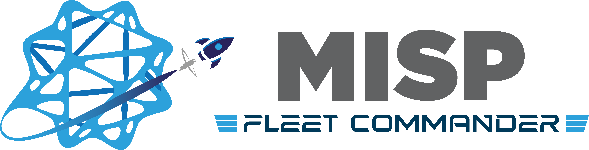
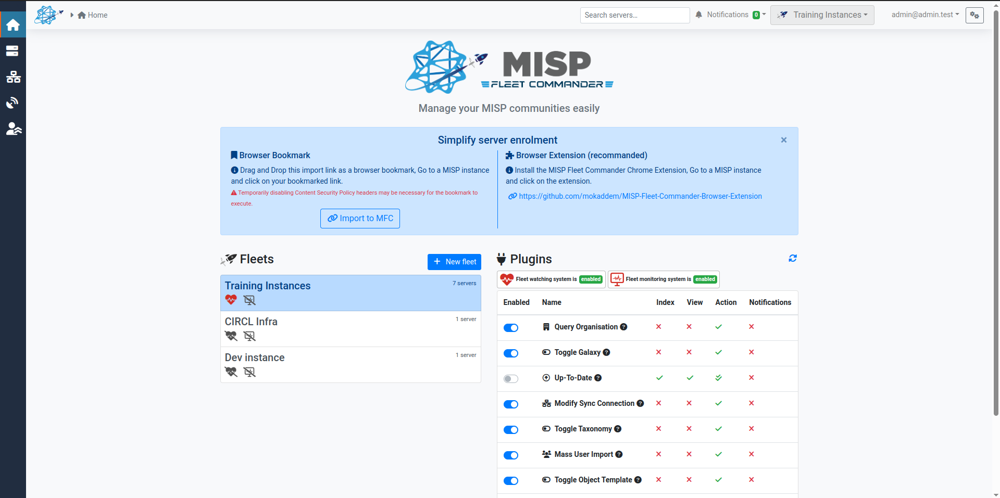
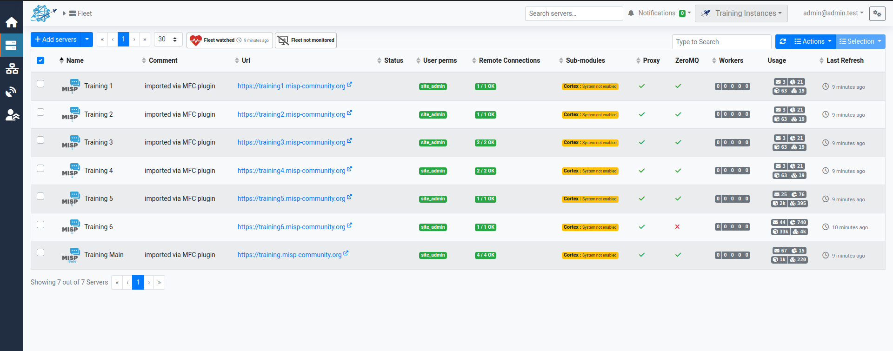
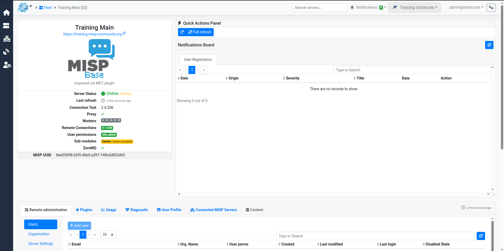
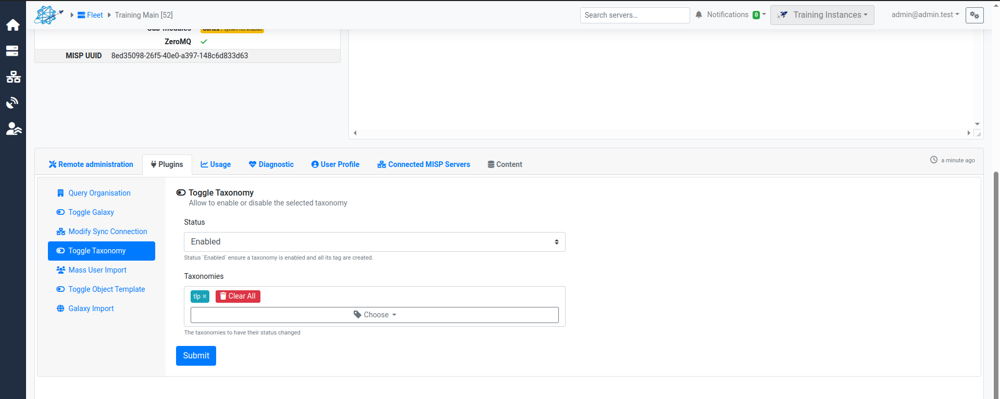
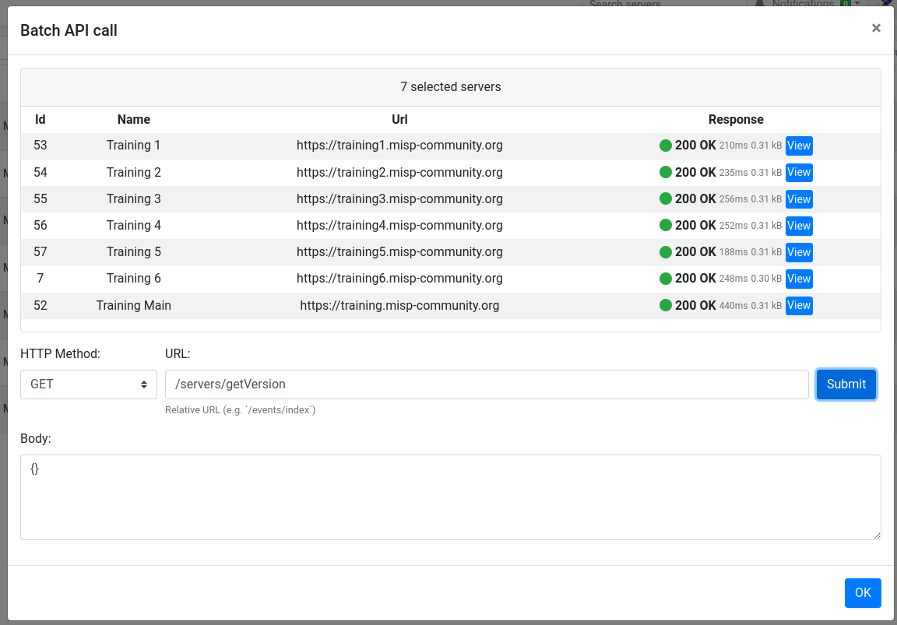
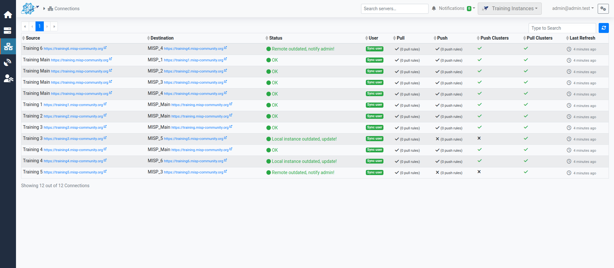
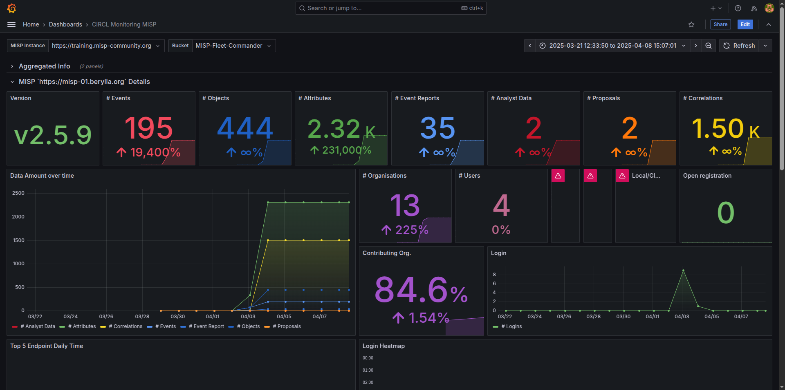

# MISP Fleet Commander


**Manage your MISP communities with ease.**

## 🛰️ What is MISP Fleet Commander?

**MISP Fleet Commander** is a flexible tool designed to manage fleets of [MISP](https://www.misp-project.org/) servers. Whether you're administering a couple of instances or an entire constellation, this application gives you the visibility and control you need — all from a single interface.

With MISP Fleet Commander, you can diagnose, configure, update, and monitor MISP servers at scale. It’s built for those who need to keep multiple MISP servers in sync and in check.


## ✨ Features

- **Create and organize fleets** of MISP servers.
- **Monitor server health** and collect real-time metrics.
- **Perform batch API operations** across servers.
- **Drag-and-drop plugin support**, integrated directly into the UI.
- **Visualize sync links and topologies** with the *Strategic View*.
- **Quickly enroll new servers** via a browser bookmarklet or extension.
- **Built-in integration with Grafana and InfluxDB** for metrics storage and visualization
- Designed for **flexibility** and ease of use.

## 💡 Why This Project?

> Back in 2021, I was managing multiple MISP servers and found myself constantly repeating tasks — monitoring health, tweaking configs, running the same API calls across instances. I also wanted to explore some modern web technologies I wasn’t familiar with. So, I started building MISP Fleet Commander in my spare time — mostly just for fun.  
>
> Now, in 2025 — four years later — it’s finally stable enough to share with the world.

This is a project built out of real-world need, shaped by curiosity and the desire to experiment and have fun. If you’ve ever had to wrangle a fleet of MISP servers, this tool is for you.


## 🚀 Getting Started

### 📦 Requirements

- python 3.12
- A modern browser (for using the UI and extensions)

### 🛠️ Installation

Clone the repository:

```bash
git clone https://github.com/mokaddem/MISP-Fleet-Commander.git
cd MISP-Fleet-Commander
```

Install dependencies:

```bash
pushd backend
bash install.sh
popd
```

### ▶️ Running the Application
Start the server:

```bash
bash start.sh
```

This will start a local server running on all addresses (0.0.0.0) (typically at http://localhost:5001) where you can interact with the UI.


### 🔄 Updating

To update the application:
```bash
bash update.sh
```

## Development
### ▶️ Running the Application (Development Mode)
Start the development server:

```bash
bash start_dev.sh
```

This will start a local development server (typically at http://localhost:5001/) and a local web development server (typically at http://localhost:8080/).


### 🏗️ Building for Production
To create an optimized production build:

```bash
bash build_web.sh
```

This will build the web application and make the file available for the backend.


## 🌍 Browser Extension / Bookmarklet
Enrolling new MISP servers can be a pain: You have to generate an API key, and manually enter all the information in MFC. However, there are quicker ways to do it.
- **[recommended]** [The MISP Fleet Commander Browser Extension](https://github.com/mokaddem/MISP-Fleet-Commander-Browser-Extension) (chrome only) allows you to enroll the MISP server you're currently browsing in one click.
- A browser bookmarklet (drag it to your bookmarks bar from the Fleet Commander UI).
  - You'll have to temporarily disable Content Security Policy headers for the bookmark to execute.

Instructions for both are available on the Home page of the app.

## 📷 Screenshots

<table>
    <tr>
        <td>
            Home page
            
        </td>
        <td>
            Fleet index
            </td>
    </tr> 
    <tr>
        <td>
            Server view
            </td>
        <td>
            Plugin page
            
        </td>
    </tr>
    <tr>
        <td>
            Batch API modal
            
        </td>
        <td>
            Strategic view page
            
        </td>
    </tr>
    <tr>
        <td>
            Connection page
            
        </td>
        <td>
            Grafana page
            
        </td>
    </tr>
</table>

## 📬 Feedback & Contributions

Contributions, bug reports, and feature suggestions are **more than welcome**!
- Fork the project
- Create a new branch (git checkout -b feature/your-feature)
- Commit your changes
- Open a pull request
- Or simply open an issue

## 📄 License

## 🤝 Acknowledgments

Special thanks to the MISP Project and its community for building such a foundational tool for threat intelligence sharing.


## ©️ Copyright
```
© 2021–2025 Sami Mokaddem.
© Logo design by Ysaline Rochez — thank you for the beautiful work!
```
